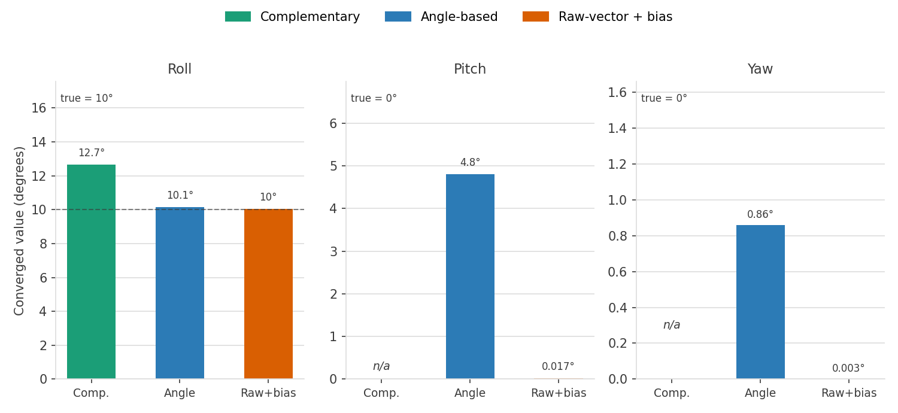
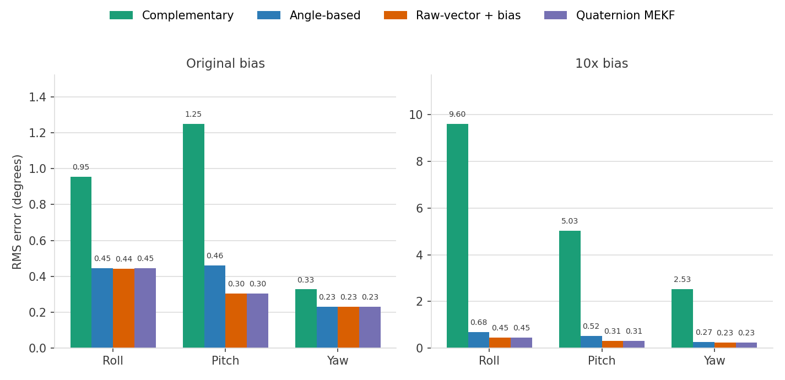

# python_drone

Attitude estimation for a drone from gyro + accelerometer + magnetometer — complementary filter vs. two EKF designs.

**Gyro bias**: a real gyro doesn't read exactly zero at rest — manufacturing imperfections, temperature drift, and vibration give it a small persistent offset that isn't true rotation. Left uncorrected it integrates into steadily growing angle error, which is why the better filters below estimate and subtract it.

## Static test (fixed 10° tilt, constant 5°/s gyro bias)

| | Complementary filter | EKF (angle-based) | EKF (raw-vector + bias) |
|---|---|---|---|
| Converged roll (true: 10°) | ~12.6–12.7° | ~10.14° | ~10.03° |
| Converged pitch (true: 0°, isolated single-axis test) | ~12.55° | ~4.8° | ~0.017° |
| Converged yaw (true: 0°, isolated single-axis test) | ~12.54° | ~0.86° | ~0.003° |

(Complementary filter has no cross-axis coupling, so pitch/yaw are tested with their own isolated 5°/s bias, not the same combined run as the EKFs.)

## Dynamic trajectory test (`ekf_gyro_bias.py`)

Sine-wave ground truth per axis, sensors synthesized from it each step (bias + noise), true value compared against the estimate directly instead of eyeballed.

| Iteration | Change | Roll error | Pitch error | Yaw error |
|---|---|---|---|---|
| 1 | Gyro synthesized; accel/mag still static | Doesn't track | Doesn't track | Doesn't track |
| 2 | Accel + mag synthesized too, but mag yaw sign was backwards | ~±1° | ~±1–2° | Grows unbounded |
| 3 | Fixed the mag yaw sign bug | ~±0.3–0.5° | ~±0.3–0.5° | ~±0.3–0.5° |

## RMS comparison (`ekf_rms.py`)

RMS (root-mean-square) error: square each iteration's error, average over the run, square-root back to degrees. One number per filter that summarizes accuracy over a whole run and penalizes big spikes more than a plain average would — the standard metric for comparing estimators.

All three filters run against identical trajectory + sensor stream (same RNG seed), fixed `dt`, 20s.

| Gyro bias | Filter | Roll RMS | Pitch RMS | Yaw RMS |
|---|---|---|---|---|
| Original (2, -1, 0.5°/s) | Complementary | 0.954° | 1.249° | 0.327° |
| Original | Angle-based | 0.445° | 0.460° | 0.230° |
| Original | Raw-vector + bias | 0.443° | 0.305° | 0.229° |
| 10x larger | Complementary | 9.603° | 5.029° | 2.534° |
| 10x larger | Angle-based | 0.681° | 0.521° | 0.268° |
| 10x larger | Raw-vector + bias | 0.449° | 0.308° | 0.229° |

Complementary is already visibly worse at original bias (fixed weight, no computed gain), and falls apart at 10x bias (roll RMS 9.6°) while both EKFs stay well-behaved — raw-vector+bias barely moves at all, since it's actively canceling the bias rather than just tolerating it.

## Motion robustness: adaptive R + gating (`ekf.py`, `test_gating.py`)

`ekf.py` now inflates accel's measurement noise (`R_accel`) when the raw accel magnitude deviates from 1g (real acceleration, not just tilt), and gates out (fully rejects) any accel reading too implausible to trust at all — a chi-squared test on the residual, 3 DOF.

`test_gating.py` injects a physically-absurd accel spike (~8.7g) for 10 iterations and compares roll with gating on vs. off:

| | Roll before spike | Max roll during spike | Recovery |
|---|---|---|---|
| Without gating | 10.06° | 32.07° | ~30+ iterations |
| With gating | 10.06° | 10.28° | Immediate |

Gating only works because it checks the residual against the *base* noise, not the already-inflated adaptive `R` — gating against the inflated value let the spike pass every time (adaptive `R` grows in lockstep with the outlier, so the Mahalanobis distance never crosses the threshold no matter how extreme the reading is).
