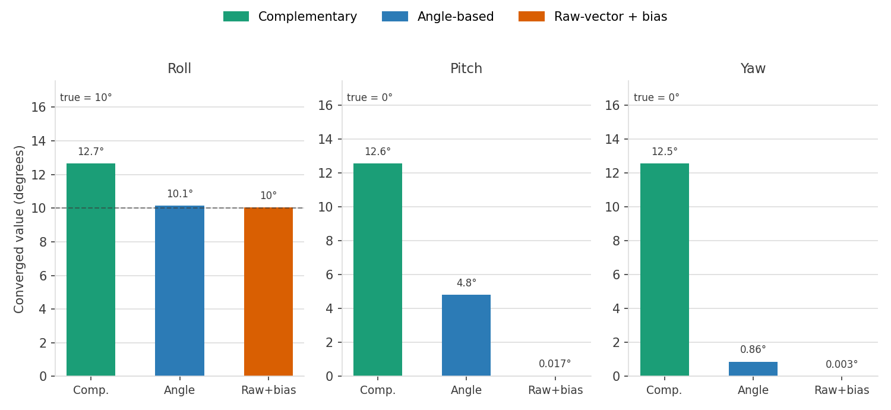
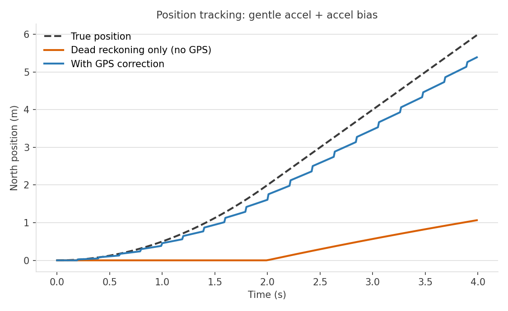
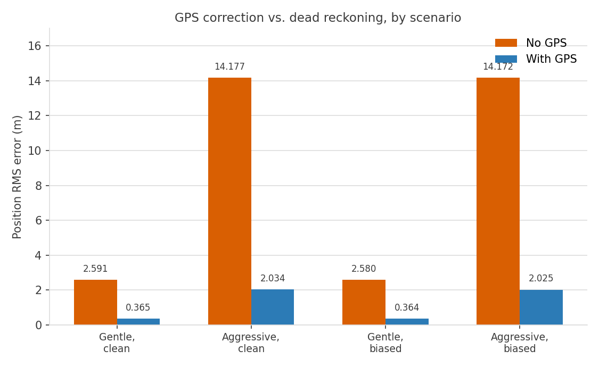

# python_drone

Attitude and position estimation for a drone from gyro + accelerometer + magnetometer + GPS — a complementary filter vs. a progression of EKF designs, from Euler-angle to quaternion attitude, adaptive noise + gating, and GPS-fused position/velocity tracking.

**Gyro bias**: a real gyro doesn't read exactly zero at rest — manufacturing imperfections, temperature drift, and vibration give it a small persistent offset that isn't true rotation. Left uncorrected it integrates into steadily growing angle error, which is why the better filters below estimate and subtract it.

## Static test (fixed 10° tilt, constant 5°/s gyro bias)

| | Complementary filter | EKF (angle-based) | EKF (raw-vector + bias) |
|---|---|---|---|
| Converged roll (true: 10°) | ~12.6–12.7° | ~10.14° | ~10.03° |
| Converged pitch (true: 0°, isolated single-axis test) | ~12.55° | ~4.8° | ~0.017° |
| Converged yaw (true: 0°, isolated single-axis test) | ~12.54° | ~0.86° | ~0.003° |

(Complementary filter has no cross-axis coupling, so pitch/yaw are tested with their own isolated 5°/s bias, not the same combined run as the EKFs.)

## Dynamic trajectory test (`ekf_gyro_bias.py`)

Sine-wave ground truth per axis, sensors synthesized from it each step (bias + noise), true value compared against the estimate directly instead of eyeballed.

| Iteration | Change | Roll error | Pitch error | Yaw error |
|---|---|---|---|---|
| 1 | Gyro synthesized; accel/mag still static | Doesn't track | Doesn't track | Doesn't track |
| 2 | Accel + mag synthesized too, but mag yaw sign was backwards | ~±1° | ~±1–2° | Grows unbounded |
| 3 | Fixed the mag yaw sign bug | ~±0.3–0.5° | ~±0.3–0.5° | ~±0.3–0.5° |

## RMS comparison (`ekf_rms.py`)

RMS (root-mean-square) error: square each iteration's error, average over the run, square-root back to degrees. One number per filter that summarizes accuracy over a whole run and penalizes big spikes more than a plain average would — the standard metric for comparing estimators.

All three filters run against identical trajectory + sensor stream (same RNG seed), fixed `dt`, 20s.

| Gyro bias | Filter | Roll RMS | Pitch RMS | Yaw RMS |
|---|---|---|---|---|
| Original (2, -1, 0.5°/s) | Complementary | 0.954° | 1.249° | 0.327° |
| Original | Angle-based | 0.445° | 0.460° | 0.230° |
| Original | Raw-vector + bias | 0.443° | 0.305° | 0.229° |
| 10x larger | Complementary | 9.603° | 5.029° | 2.534° |
| 10x larger | Angle-based | 0.681° | 0.521° | 0.268° |
| 10x larger | Raw-vector + bias | 0.449° | 0.308° | 0.229° |

Complementary is already visibly worse at original bias (fixed weight, no computed gain), and falls apart at 10x bias (roll RMS 9.6°) while both EKFs stay well-behaved — raw-vector+bias barely moves at all, since it's actively canceling the bias rather than just tolerating it.

## From EKF to MEKF: quaternion attitude (`quaternarions.py`)

Switched the attitude state from Euler angles to a quaternion, which turns this into a multiplicative EKF (MEKF): a quaternion has 4 numbers for only 3 rotational degrees of freedom, so it can't be corrected by plain vector addition the way Euler angles can. Instead, the Kalman math (`P`, `K`) runs on a 3-dimensional small-angle error state, which then gets folded onto the quaternion multiplicatively and renormalized — this avoids gimbal lock (no singular orientation, unlike Euler angles) and keeps the covariance math well-posed instead of operating on a redundant, constrained state. It performed essentially identically on the RMS test (~0.445°/0.305°/0.230° vs. 0.443/0.305/0.229 for the Euler version), which is expected — same underlying model, just a numerically better-behaved state representation.

## Motion robustness: adaptive R + gating (`ekf.py`, `test_gating.py`)

`ekf.py` now inflates accel's measurement noise (`R_accel`) when the raw accel magnitude deviates from 1g (real acceleration, not just tilt), and gates out (fully rejects) any accel reading too implausible to trust at all — a chi-squared test on the residual, 3 DOF.

`test_gating.py` injects a physically-absurd accel spike (~8.7g) for 10 iterations and compares roll with gating on vs. off:

| | Roll before spike | Max roll during spike | Recovery |
|---|---|---|---|
| Without gating | 10.06° | 32.07° | ~30+ iterations |
| With gating | 10.06° | 10.28° | Immediate |

Gating only works because it checks the residual against the *base* noise, not the already-inflated adaptive `R` — gating against the inflated value let the spike pass every time (adaptive `R` grows in lockstep with the outlier, so the Mahalanobis distance never crosses the threshold no matter how extreme the reading is).

## GPS position/velocity tracking (`gps.py`, `test_gps_tracking.py`)

Extends the quaternion MEKF's error state to 12 dimensions (adds velocity + position), predicting from gravity-compensated world-frame acceleration and correcting with GPS position + velocity gated to a realistic ~5Hz, instead of every IMU tick.

GPS cuts position error 8-10x across the board; a 10°-tilted version of each scenario matches these numbers exactly, confirming `update_F`'s attitude/acceleration coupling handles a non-identity attitude correctly.

## Gating all three corrections (`gps.py`, `test_gates.py`)

`gps.py` gates every correction source, not just accel: accel and mag each get a 3-DOF chi-squared test on their residual, and GPS gets its own 6-DOF version (it corrects position + velocity jointly). Any correction that fails its gate is skipped entirely for that tick — state and `P` are left exactly as the predict step produced them, rather than clamped or partially applied.

`test_gates.py` checks two things: that the gates stay quiet on clean data (a gate that fires on legitimate readings is worse than no gate at all), and that they actually catch a bad reading the way the original accel gate did. It runs a stationary ground truth so any deviation is unambiguous, injects a +50m GPS multipath-style spike and a 90°-wrong magnetometer reading, and compares gates on vs. off:

| | GPS rejected | Mag rejected | Peak position error | Peak attitude error |
|---|---|---|---|---|
| Clean run (no outliers) | 0/0 | 0/0 | — | — |
| Gates ON | 1/1 | 1/1 | 0.00 m | 0.00° |
| Gates OFF | 0/1 | 0/1 | 9.82 m | 15.53° |

With gates on, both outliers are caught and the state never moves. Without them, the GPS spike alone injects ~9.4m of position error that takes many correction cycles to bleed off, and the mag spike's ~15.5° of attitude error keeps doing damage afterward — the corrupted attitude estimate misreads subsequent accelerometer readings, so position keeps drifting for several ticks even though the bad reading was magnetometer, not GPS.

## Pooled vs. sequential corrections (`gps.py`, `calibration.py`, `test_gate_monte_carlo.py`)

Before this fix, `gps.py` computed GPS, accel, and mag corrections against the *same* attitude estimate `q̂`, summed all three into one `error_state`, and injected them once at the end of the tick. That's a fine simplification for a linear system - batching and processing sequentially are mathematically identical there, sequential is just cheaper. It's not fine for an EKF, where `H` is a function of the current `q̂`: two large-gain corrections (accel and mag) evaluated against the same *stale* linearization can double-count and overcorrect, especially right after startup when `P` is still large and every gain is aggressive.

That's exactly what happened. A Monte Carlo sweep (`test_gate_monte_carlo.py`, 20 seeds, no injected outliers) found that starting from `P0 = np.eye(15)`, the pooled version had a **6/20 (30%) chance of permanently locking the accel gate on** - one bad startup correction would throw attitude far enough off that every subsequent legitimate accel reading looked like an outlier, and the gate (correctly) kept protecting the now-wrong state from ever being fixed.

The fix: apply each correction immediately (`apply_correction()`) and re-linearize before the next one, instead of pooling. GPS updates `q̂` first; accel's `predicted_accel` is computed from *that* `q̂`, not the pre-tick one; mag's `predicted_mag` is computed from the `q̂` accel's correction just produced. This is the same math a linear Kalman filter would call "sequential processing," just carried through to the nonlinear case by actually re-linearizing between steps - closer to an iterated EKF than a batch update.

| | Lockout rate (20 trials, `P0 = eye(15)`) |
|---|---|
| Pooled (before) | 6/20 (30%) |
| Sequential (after) | 0/20 |

The lockout also disappears with a better-tuned `P0` alone (seeded from `calibration.calibrate()`'s own converged covariance instead of a blind identity guess - see `calibration.py`), which is what most of the practical improvement comes from day to day. But re-running the *sequential* fix against the original bad `P0 = eye(15)` still gave 0/20 lockouts - proof the correction-ordering fix removes the actual overcorrection mechanism, not just one trigger for it. Belt and suspenders: a good `P0` avoids the failure mode most of the time; sequential correction closes it structurally, in case `P` ever grows large again mid-flight (sensor dropout, an extended gyro-only stretch).

Gate calibration on clean (outlier-free) data improved alongside it - expected false-rejection rate is ~1% (99% CI threshold); with both fixes in place, empirical rates came out at 0.08% (accel), 0.42% (mag), 0.89% (GPS), down from 24.8% / 58.6% / 77.5% beforehand.
